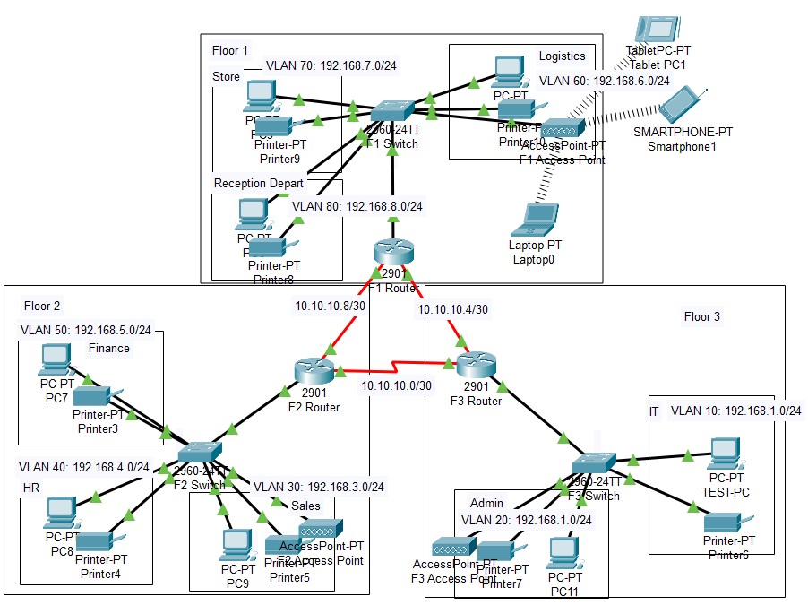

# Modern Hotel Network Design

This project involves designing and implementing a Modern Hotel network, which spans 3 floors, each hosting different departments. The network is built using VLAN segmentation, OSPF routing, DHCP, and port security, ensuring efficient communication and security across the infrastructure.

## Network Architecture

* **Three routers** interconnect all floors using serial DCE cables.
* Each floor has a switch, connecting departments and providing WiFi connectivity for laptops and mobile devices.
* **VLAN segmentation** is used to logically separate departments, with eight VLANs assigned across the three floors.
* **DHCP configuration** enables dynamic IP assignment for all devices.
* **Printers** are allocated to each department.

## VLAN Assignments

1st Floor:
* Reception - VLAN 80 (192.168.0.0/24)
* Store - VLAN 70 (192.168.7.0/24)
* Logistics - VLAN 60 (192.168.6.0/24)
2nd Floor:
* Finance - VLAN 50 (192.168.5.0/24)
* HR - VLAN 40 (192.168.4.0/24)
* Sales - VLAN 30 (192.168.3.0/24)
3rd Floor:
* Admin - VLAN 20 (192.168.2.0/24)
* IT - VLAN 10 (192.168.1.0/24)

## Routing and Security Features

* **OSPF routing** is implemented to advertise VLAN networks.
* **Inter-VLAN routing** ensures seamless communication across departments.
* **Port security** is applied in the IT department to restrict access to Test-PC on port fa0/1, using sticky MAC address learning.
* **SSH** is configured on routers for secure remote login.

## Key Configurations Implemented

✅ VLAN creation and assignment.
✅ DHCP configuration for dynamic IP allocation.
✅ OSPF routing setup.
✅ SSH access for router security.
✅ Port security to restrict unauthorized access.

## Conclusion

This network design ensures a scalable, secure, and efficient infrastructure for Modern Hotel, enabling smooth communication and access control between departments.