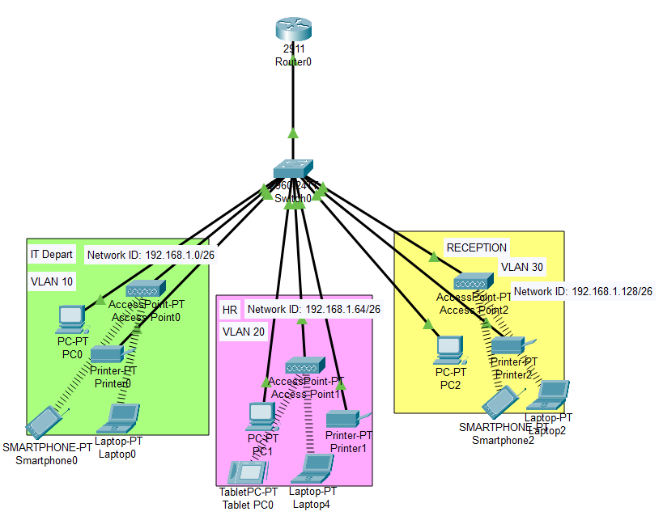

# Small Company Network Design and Implementation

This project outlines the design and implementation of a small network for a branch office of a small company.The network is designed to be separate from the company's headquarters network and caters to three departments: IT, HR, and Reception.

## Project Requirements

The following requirements were provided for the network implementation:

* **Hardware:** One Cisco router and one Cisco switch.
* **Departments:** Three departments (Admin/IT, Finance/HR, and Customer Service/Reception) with separate VLANs for each.
* **Wireless Network:** Each department requires a dedicated wireless network.
* **IP Addressing:** Devices should obtain IPv4 addresses automatically (DHCP).
* **Interconnectivity:** All devices across departments should be able to communicate with each other.
* **IP Network:** The ISP provided a base network of 192.168.1.0.

## Design

The network design incorporates the following elements:

* **VLANs:**  Three VLANs are created to segment the network for each department:
    * VLAN 10: Admin/IT
    * VLAN 20: Finance/HR
    * VLAN 30: Customer Service/Reception
* **DHCP Server:** The router acts as a DHCP server, providing IP addresses to devices within each VLAN.  DHCP scopes are configured specifically for each VLAN.
* **Routing:** Inter-VLAN routing is configured on the router to enable communication between all departments.
* **Wireless Access Points:**  Wireless Access Points (WAPs) are connected to the switch, with each WAP configured to broadcast separate SSIDs associated with the corresponding VLAN.  This ensures wireless users connect to the correct network segment.
* **Security:** Basic security measures, such as access lists, can be implemented on the router to restrict traffic flow if required.

## Implementation Steps (Summary)

1. **Configuration:** Configure the Cisco router and switch with the necessary VLANs, DHCP scopes, routing protocols, and security measures.
2. **Connectivity:** Connect the router to the ISP provided connection, the switch to the router, and the WAPs to the switch.
3. **Verification:** Test network connectivity between all departments, including wireless connectivity. Verify DHCP functionality and internet access.

## Conclusion

This project successfully implements a small-scale network for a company with 3 departments, meeting all the specified requirements. The network provides secure and efficient communication between departments, ensuring smooth business operations.